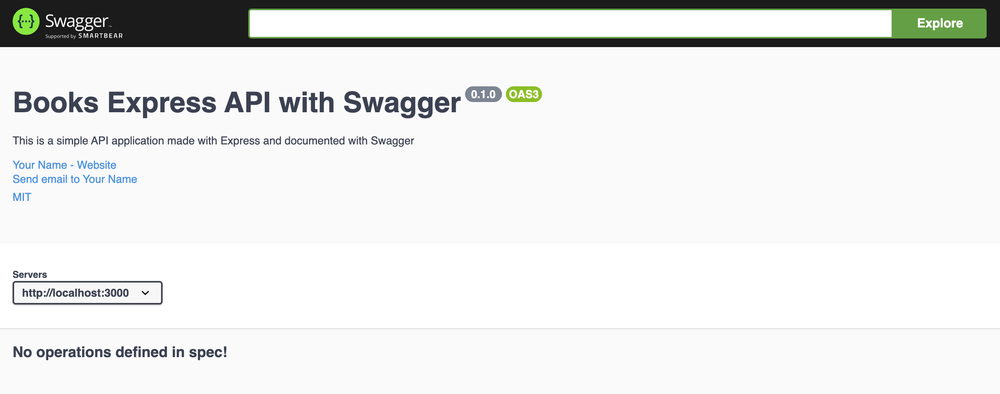
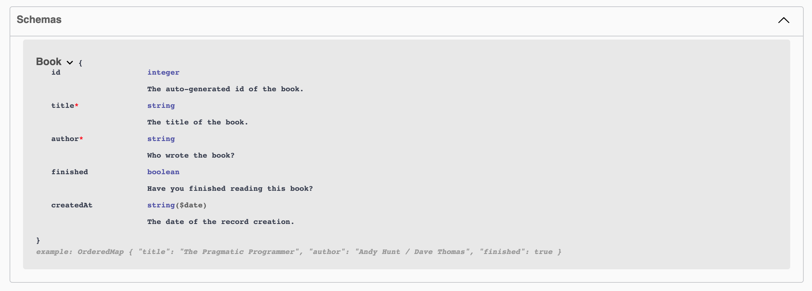
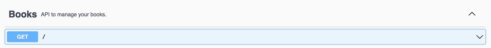

# API Documentation using Swagger
You have learnt so much about API building already. Now it's time to practice creating interactive API documentation and add some swag to our backend skillset. The objectives of this assignment are:
1. Learning to use Swagger to generate API docs
2. Practicing building our own API routes with documentation


## Setup
Once you have cloned this assignment repo, you will find quite a bit of starter code in a file called `server.js`. Basically, we have created a simple Books API. You can quickly start the server and test out the existing API routes.

## Understanding our tools before we start coding
For this assignment, we will use two NPM packages: swagger-ui-express and swagger-jsdoc.

### Swagger
You have already read about the API documentation and design tool called [Swagger](https://swagger.io/) in the previous lesson. You probably have already explored [this pet store API documentation example](https://petstore.swagger.io/) which is built using Swagger. If you're still wondering, what does it take to create this interactive documentation? The answer is here -- in [this JSON file](https://petstore.swagger.io/v2/swagger.json).

**Note**: If the JSON file is unreadable when opening on your browser, you can visit the [JSON formatter site](https://jsonformatter.org/json-pretty-print). Click on "Load Data" and add the above JSON URL. And voila, you'll have a pretty printed readable JSON.

If you observe the JSON carefully, you'll see that there is a key-value configuration for everything that you see on the Swagger documentation. Starting from basic description and links to API definitions and data models.

The Swagger tool reads through this JSON file and automatically generates the UI for the interactive documentation based on provided configurations. This can also be done using a YAML file. You can explore the YAML file syntax on the [Swagger Editor tool](https://editor.swagger.io/?_ga=2.267295566.1714809516.1635541262-114255116.1628680400).

The length and extent of the Swagger config file (JSON or YAML) depends on how long and extensive your API suite is.

### JSDoc
There is another popular documentation tool called [JSDoc](https://jsdoc.app/about-getting-started.html). This tool helps us add documentation comments directly to our source code, right alongside the code itself. Then it scans the source code for these comments and generates an HTML documentation website.

For example, take a look at this simple JSDoc comment for a constructor called Book.
```js
/**
 * Represents a book.
 * @constructor
 * @param {string} title - The title of the book.
 * @param {string} author - The author of the book.
 */
function Book(title, author) {
}
```

Let's say that we've added JSDoc comments on all functions within a file called `book.js`. Then we can run the command `jsdoc book.js` and generate HTML files for documentation.

### Best of both worlds
We will neither use a long Swagger JSON file nor generate HTML documentation files using JSDoc. We will use a library called [swagger-jsdoc](https://www.npmjs.com/package/swagger-jsdoc) which reads JSDoc-annotated source code and generates an OpenAPI (Swagger) specification. Along with this, we will use [swagger-ui-express](https://www.npmjs.com/package/swagger-ui-express) that will help us serve the auto-generated Swagger UI from our Express application.

## Let's get started
First of all, let's install the above mentioned packages:
```
npm install swagger-ui-express swagger-jsdoc
```

Once the dependencies are installed, we'll import these packages in our `server.js` file. Add these lines below the existing package require statements:
```js
const swaggerJsdoc = require("swagger-jsdoc");
const swaggerUi = require("swagger-ui-express");
```

Now we will put together some configuration options for Swagger to work with our Express application. Add the following code _just before our app's listen function_. You will also find a guiding comment for this in the code.

```js
const options = {
  definition: {
    openapi: "3.0.0",
    info: {
      title: "Books Express API with Swagger",
      version: "0.1.0",
      description:
        "This is a simple API application made with Express and documented with Swagger",
      license: {
        name: "MIT",
        url: "https://spdx.org/licenses/MIT.html",
      },
      contact: {
        name: "Your Name",
        url: "https://re-coded.com",
        email: "youremail@email.com",
      },
    },
    servers: [
      {
        url: "http://localhost:3000",
      },
    ],
  },
  apis: ["./server.js"],
};
```

**NOTE**: In these configuration options, make sure to add your name and email in the contact property.

The configuration object has 2 main properties: `definition` and `apis`. Within the `definition` we are setting OpenAPI version to 3.0.0. Swagger makes use of the Open API Specification, which is a standard, language-agnostic interface for RESTful APIs allowing humans and machines to understand the capabilities of a web service without having to access the source code or inspect the network traffic. Then we are providing some info about our API: title, description, license, the contact of the API owner, etc.
And finally the URL of our server. In `apis` property, we are providing the file path where our API code lives.

Now add these lines below the configuration options:
```js
const specs = swaggerJsdoc(options);
app.use("/api-docs", swaggerUi.serve, swaggerUi.setup(specs, { explorer: true }));
```

This means that we’re using the swaggerJsdoc function to scan through the options passed in as a param and return the converted Swagger specification object. This one, in turn, is being used with the swaggerUi setup process.

Let's restart our app now with `npm start` and visit `http://localhost:3000/api-docs/` on the browser. You should be able to see this:


Our Swagger UI is working! But we don't have any API operations or data models on it yet.

## Creating the API documentation
First let's create a data model for our books collection. This means we will document the structure of the Book entity. Add these lines _just above the definition of our books array_.
```
/**
*  @swagger
*    components:
*      schemas:
*        Book:
*          type: object
*          required:
*            - title
*            - author
*          properties:
*            id:
*              type: integer
*              description: The auto-generated id of the book.
*            title:
*              type: string
*              description: The title of the book.
*            author:
*              type: string
*              description: Who wrote the book?
*            finished:
*              type: boolean
*              description: Have you finished reading this book?
*            createdAt:
*              type: string
*              format: date
*              description: The date of the record creation.
*          example:
*              title: The Pragmatic Programmer
*              author: Andy Hunt / Dave Thomas
*              finished: true
*/
```

This is a JSDoc style comment following the Swagger YAML syntax. swagger-jsdoc will read this and do its magic now. Return to the documentation UI and refresh the page. You should be able to see this:


For an API with more data entities, you can define more schemas. We only have a Book entity in this API implementation.

Now, let's add our first API specification. Add these lines _just above our index route `/` GET handler_.
```
/**
*  @swagger
*    tags:
*        name: Books
*        description: API to manage your books.
*/

/**
* @swagger
* /:
*   get:
*     tags: [Books]
*     description: Simple index API route
*     responses:
*       200:
*         description: Returns a simple description string.
*/
```

You should see this on the documentation UI:


You can expand this API explorer view and execute a trial API request using the "Try it out" button. You should be able to see the real-time API response!

So finally, let's add one more API specification together. Add these lines _just above our route `/books` GET handler_.
```
/**
*  @swagger
*    /books:
*        get:
*            tags: [Books]
*            description: Lists all the books
*            responses:
*                200:
*                    description: List of all books
*                    content:
*                        application/json:
*                            schema:
*                                $ref: '#/components/schemas/Book'
*/
```

You will see a new GET API explorer on the UI for `/books` route.

## Practice Time
Are you enjoying Swagger so far? Just a few lines can generate a complete and interactive API documentation. We have guided you till here, now it's time for you to explore, learn and complete the assignment.

### Requirements
1. Create the API explorers for the remaining 2 endpoints to get a specific book and to add a new book.
2. Create at least 2 more API endpoints of your choice. Think of different HTTP methods and different operations that can be performed on our books collection.
3. Create API explorers for the API endpoints you added.

Make sure you include the following in your API explorers:
- Add the correct paths and operations
- Describe parameters for relevant paths
- Describe the request body for relevant paths
- Describe responses including error responses for all paths
- Add examples for all paths

You can explore the [Swagger OpenAPI Guide](https://swagger.io/docs/specification/about/) to learn about different configuration options.

### Submission
There are no automated submission tests for this assignment. We strongly recommend that you manually test out each API route on the Swagger UI before submitting your assignment.

Once you're ready to submit the assignment, follow these steps on your terminal:
1. Stage your changes to be committed: `git add .`
2. Commit your changes: `git commit -m "solve assignment"`
3. Push your commit to the main branch of your assignment repo: `git push origin main`

After your changes are pushed, return to this assignment on Canvas for the final step of submission.

---
## References
- https://blog.logrocket.com/documenting-your-express-api-with-swagger/